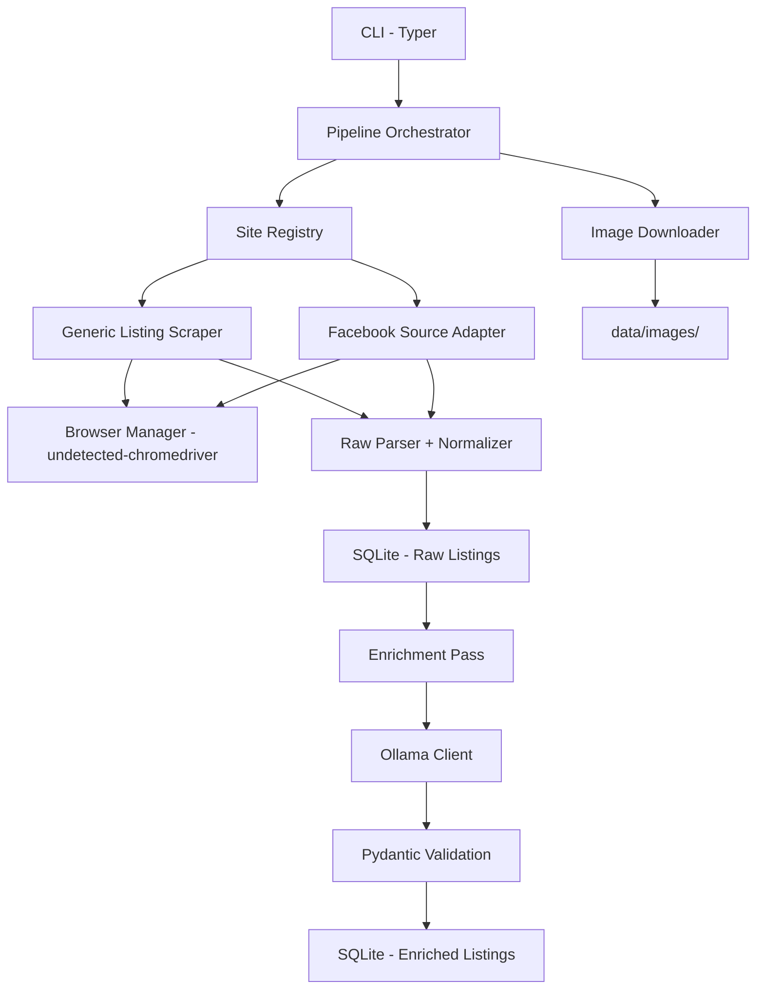

# Flat Finder — Multi-Site Real Estate Search Aggregator

A production-minded, local-first Python aggregator designed to scrape, parse, normalize, and enrich flat, room, and flatshare listings from multiple real-estate sites in Prague. It deterministically processes listing prices/sizes, utilizes a locally hosted LLM via Ollama for advanced unstructured analysis, scores suitability based on commutes to Prague 8 (New Palmovka / The Docks), and saves records into a structured SQLite database.

---

## 🏗️ Architecture



The system operates in a robust, **two-stage pipeline**:
1. **Scraping Stage**: Navigates targets using `undetected-chromedriver` (Selenium), extracts raw items using CSS selectors, runs deterministic parsing logic, and records entries to `listings_raw`.
2. **Enrichment Stage**: Reads un-enriched rows, passes unstructured data to a local Ollama LLM, validates structured JSON outputs via Pydantic, calculates Prague housing target scores (0-100), and records completed results to `listings_enriched`.

---

## 🛠️ Prerequisites

- **Python 3.12+**
- **Google Chrome** (installed system-wide — undetected-chromedriver uses your real Chrome binary)
- **Local Ollama Instance** (installed and running)
- **SQLite3**

---

## 🚀 Setup & Installation

### 1. Project Installation
Clone the repository to your local machine, navigate to the directory, and install the package along with development requirements:
```bash
# Create and activate virtual environment
py -m venv .venv
.venv\Scripts\activate  # Windows

# Install Flat Finder with development dependencies
pip install -e ".[dev]"
```

### 2. Configure the Environment
Copy the environment template and adjust paths or logging thresholds as needed:
```bash
copy .env.example .env
```

> **Note:** No browser binary downloads needed. `undetected-chromedriver` automatically detects and patches your locally installed Google Chrome.

### 3. Local Ollama Setup
Start your local Ollama application, then pull your target LLM model (default is `llama3.1`):
```bash
ollama serve
ollama pull llama3.1
```
> **Tip:** You can specify other local models (e.g. `mistral`, `qwen2.5`, `gemma2`) by modifying the `OLLAMA_MODEL` value inside configs/common.yaml or .env.

---

## ⚡ Quickstart Scripts (Windows)

For convenience, two pre-configured double-clickable Windows batch files are included in the project root:
- **`run_scrape.bat`**: Initializes the database and executes a scraping crawl across all enabled websites.
- **`start_webapp.bat`**: Starts the local FastAPI web server. Run this, then visit `http://localhost:8000` to browse listings.

---

## 📁 File Structure & Data Folders
Flat Finder enforces a clean local-first workspace structure:
- **`configs/`**: Global rules (`common.yaml`) and site-specific CSS selectors (`sites/*.yaml`).
- **`data/`** (created at startup):
  - `data/db/`: SQLite databases.
  - `data/raw/`: Generated CSV exports.
  - `data/images/`: Locally downloaded listing pictures, grouped by source ID.
  - `data/logs/`: Production logs (`flat_finder.log`).
  - `data/browser_state/`: Saved Facebook persistent login cookies and Chrome user-data profile.
  - `data/screenshots/`: Debug screenshots captured during navigation errors.

---

## 🎛️ CLI Usage

Flat Finder provides a feature-rich CLI via Typer. Once installed, run commands using `py -m app.cli` or directly via the `flat-finder` shortcut.

### 1. Initialize the Database
Build SQLite schemas, unique constraints, and search indexes:
```bash
py -m app.cli init-db
```

### 2. Discover Configured Sites
Verify loaded site configs and active statuses:
```bash
py -m app.cli list-sites
```

### 3. Test Selectors Validate Config
Test-load a site config configuration mapping without launching a browser:
```bash
py -m app.cli test-site --site example_sreality
```

### 4. Run Phase 1: Scrape Raw Listings
Fetch listing cards and save raw rows into the database:
```bash
# Scrape all active enabled sites
py -m app.cli scrape --site all

# Scrape a specific named site
py -m app.cli scrape --site example_sreality
```

### 5. Run Phase 2: LLM Enrichment Pass
Process raw listings with Ollama structured generation and calculate Prague suitability:
```bash
# Process all pending rows
py -m app.cli enrich --site all

# Enrich a limited subset of listings
py -m app.cli enrich --site all --limit 10
```

### 6. Run the Full Pipeline
Scrape target sites, then immediately enrich newly logged listings in a single pass:
```bash
py -m app.cli run --site all
```

### 7. Download Images
Locally save main and secondary image assets:
```bash
py -m app.cli download-images --site all --max-images 5
```

### 8. Export CSV
Generate sorted, Prague commute-scored outputs for spreadsheet comparison:
```bash
py -m app.cli export-csv --output data/raw/prague_listings.csv
```

### 9. Launch Localhost Web App Dashboard
Explore, search, filter, sort, and exclude aggregated real-estate listings directly from a sleek glassmorphic browser user interface:
```bash
py -m app.cli serve
```
Then open your browser and navigate to `http://localhost:8000`.

---

## 📋 Database Tables Reference

### `listings_raw`
Stores raw extracted parameters exactly as scraped from websites. Deduplication is strictly locked on `UNIQUE(source_id, canonical_url)`. If a duplicate listing is scraped, fields are updated and `last_seen_at` is refreshed while `first_seen_at` remains unchanged.

### `listings_enriched`
Contains finalized, clean values parsed deterministically or generated by Ollama. Highlights:
- **`total_monthly_value`**: Monthly rent plus utility fees.
- **`suitability_score`** (0-100): Calculated from scoring rules (Karlín/Palmovka commute, budget fit, private flatshare room, furnished, balcony/garage).
- **`validation_status`**: Identifies clear listings (`VERIFIED`), price conflicts (`PRICE_MISMATCH`), missing utilities (`UTILITIES_UNCONFIRMED`), or blocked ads (`EXCLUDED`).

---

## ⚙️ Adding a New Real-Estate Site

To integrate a new website, create a single YAML file under `configs/sites/[site_name].yaml`. 

1. Set `source_type: "normal_listing_site"` and choose an `extraction_mode` ("listing_cards_only" or "hybrid").
2. Set up page navigation rules (e.g. `pagination.type: "page_param"` and `page_param_name: "page"`).
3. Fill in target CSS selectors under `fields` (card level) and `detail_fields` (page level if hybrid mode is active).
4. Run the validation check command:
   ```bash
   py -m app.cli test-site --site [your_site_name]
   ```
5. Mark `enabled: true` and execute the scraper pipeline.

---

## 👥 Facebook Scraper (Brittle Adapter Caveats)

Flat Finder includes a separate Facebook group scraper (`facebook_group`) to harvest listings from flatshare groups. 

> [!WARNING]
> **Brittle Adapter:** Facebook changes class markups regularly, actively locks profiles, and blocks script headers. This adapter acts as a lower-confidence, best-effort raw text parser. Use it responsibly and in moderation to avoid profile lockups.

### Persist Manual Cookie Credentials Session
To bypass basic logins, launch a manual browser session. Log in to Facebook normally, solve MFA prompts, then return to your console and click Enter:
```bash
py -m app.cli login-facebook
```
This stores your cookie credentials into `data/browser_state/` as a persistent Chrome profile.

### Run Facebook Scraper
Execute the visible post text parser using your saved persistent session:
```bash
py -m app.cli scrape-facebook
```

---

## 🧪 Testing

Execute automated unit tests covering standard Czech price parsing, float areas matching, layouts mapping, boolean amenities, in-memory SQLite upserts, and model schemas validation:
```bash
pytest tests/ -v
```

---

## ⚖️ Legal & Ethical Note

Ensure your scraping workflows comply with your target websites' terms of service, robots.txt exclusions, and local data collection laws. Add polite random rate limiting (`rate_limit.min_delay_ms` / `rate_limit.max_delay_ms`) inside all site configurations to respect target server limits.
